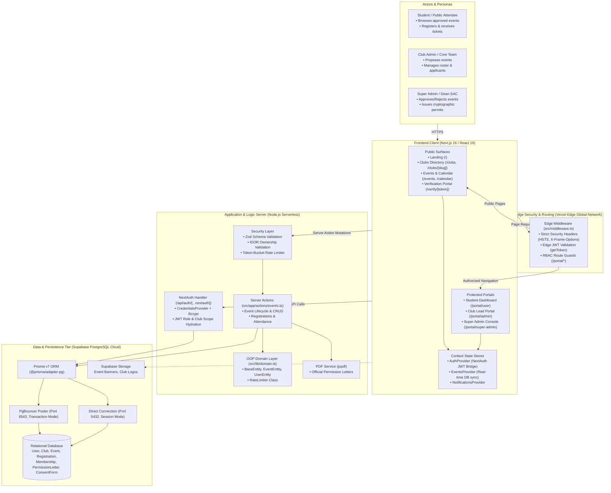

# VIT Clubs — System Architecture (C4 Container Diagram)

This diagram details the top-level application containers, security boundaries, client surfaces, and serverless compute tiers.

```mermaid
flowchart TD
    subgraph Users["Actors & Personas"]
        Student["Student / Public Attendee<br/>• Browses approved events<br/>• Registers & receives tickets"]
        ClubLead["Club Admin / Core Team<br/>• Proposes events<br/>• Manages roster & applicants"]
        SuperAdmin["Super Admin / Dean SAC<br/>• Approves/Rejects events<br/>• Issues cryptographic permits"]
    end

    subgraph ClientLayer["Frontend Client (Next.js 16 / React 19)"]
        PublicViews["Public Surfaces<br/>• Landing (/)<br/>• Clubs Directory (/clubs, /clubs/[slug])<br/>• Events & Calendar (/events, /calendar)<br/>• Verification Portal (/verify/[token])"]
        ProtectedPortals["Protected Portals<br/>• Student Dashboard (/portal/user)<br/>• Club Lead Portal (/portal/admin)<br/>• Super Admin Console (/portal/super-admin)"]
        ContextState["Context State Stores<br/>• AuthProvider (NextAuth JWT Bridge)<br/>• EventsProvider (Real-time DB sync)<br/>• NotificationsProvider"]
        PublicViews --> ContextState
        ProtectedPortals --> ContextState
    end

    subgraph EdgeLayer["Edge Security & Routing (Vercel Edge Global Network)"]
        EdgeMW["Edge Middleware (src/middleware.ts)<br/>• Strict Security Headers (HSTS, X-Frame-Options)<br/>• Edge JWT Validation (getToken)<br/>• RBAC Route Guards (/portal/*)"]
    end

    subgraph AppLayer["Application & Logic Server (Node.js Serverless)"]
        AuthHandler["NextAuth Handler (/api/auth/[...nextauth])<br/>• CredentialsProvider + Bcrypt<br/>• JWT Role & Club Scope Hydration"]
        ServerActions["Server Actions (src/app/actions/events.ts)<br/>• Event Lifecycle & CRUD<br/>• Registrations & Attendance"]
        SecurityGuards["Security Layer<br/>• Zod Schema Validation<br/>• IDOR Ownership Validation<br/>• Token-Bucket Rate Limiter"]
        OOPDomain["OOP Domain Layer (src/lib/domain.ts)<br/>• BaseEntity, EventEntity, UserEntity<br/>• RateLimiter Class"]
        PDFGen["PDF Service (jspdf)<br/>• Official Permission Letters"]
    end

    subgraph DataLayer["Data & Persistence Tier (Supabase PostgreSQL Cloud)"]
        PrismaORM["Prisma v7 ORM (@prisma/adapter-pg)"]
        Pooler["PgBouncer Pooler (Port 6543, Transaction Mode)"]
        DirectDB["Direct Connection (Port 5432, Session Mode)"]
        PostgresTables[("Relational Database<br/>User, Club, Event, Registration,<br/>Membership, PermissionLetter, ConsentForm")]
        Storage["Supabase Storage<br/>Event Banners, Club Logos"]
    end

    Users -->|HTTPS| ClientLayer
    ClientLayer -->|Page Requests| EdgeMW
    EdgeMW -->|Authorized Navigation| ProtectedPortals
    EdgeMW -->|Public Pages| PublicViews
    ClientLayer -->|API Calls| AuthHandler
    ClientLayer -->|Server Action Mutations| SecurityGuards

    SecurityGuards --> ServerActions
    ServerActions --> OOPDomain
    ServerActions --> PDFGen
    AuthHandler --> PrismaORM
    ServerActions --> PrismaORM

    PrismaORM --> Pooler
    PrismaORM --> DirectDB
    Pooler --> PostgresTables
    DirectDB --> PostgresTables
    ClientLayer -.->|CDN GET| Storage
```
